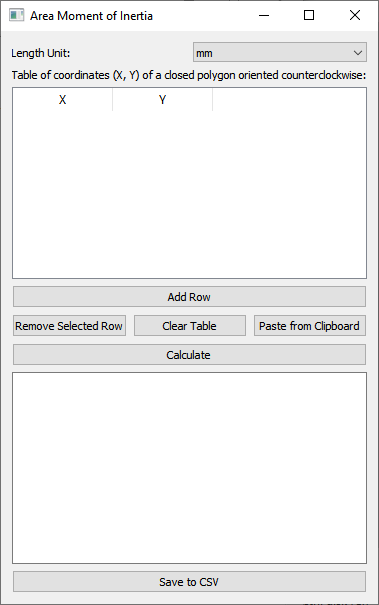

# AMoI

Area moment of inertia (the second moment of area) and properties of plane area

Created for educational purposes.

This script is used to calculate area moments of inertia, where the area is given by a closed polygon along its perimeter. The program allows you to enter the coordinates of the closed polygon and calculates the moments of inertia to the principal axes, the coordinates of the center of gravity, and the radius of inertia. The result is displayed both in a graph and in a text output.

## Installation

Python 3.6 and higher must be installed (tested with version 3.12.2). You also need to install the packages `PyQt5`, `matplotlib` and `numpy` if they are not already installed with the command
```
pip install PyQt5 matplotlib numpy
```
The [requirements.txt](requirements.txt) file lists the versions of the packages with which the program was tested. It is therefore possible to use the alternative command 
```
pip install -r requirements.txt
```
Running the program from the command line
```
python AMoI.py
```
or building an executable program with the `pyinstaller` package, which is installed with the
```
pip install pyinstaller
```
The command to build the executable program is
```
pyinstaller --onefile AMoI.py
```

## Using the program

When you start the program, the main window opens:



1. **Selecting the unit of length:**
Use the **Length unit** drop-down box to select the appropriate physical unit (mm, cm, m), which will then be displayed in the graph and in the calculated values list.
2.	**Entering coordinates:**
Enter the coordinates of the closed polygon into the table. Enter each point of the polygon in a new row. The details of the entry are described below with a description of the buttons.
3.	**Coordinate table entry buttons:**
* **Add Row**: Adds a new blank row to the table.
* **Delete Row**: Deletes the currently selected row. When selecting a larger area, removes only the last row.
* **Delete Table**: Deletes the entire table.
* **Paste from Clipboard**: Paste the coordinates copied to the clipboard. Assumes indented text format with columns separated by tabs or ";", i.e. can be copied from Excel, Google Sheets, test editors, etc. The program checks the number of columns per line (must be 2) and replaces the decimal separator "," with ".".
4.	**Calculation:**
After entering the polygon coordinates, press the **Calculate** button. The program displays the results of the calculation in a text box and plots a graph of the polygon including the principal axes and moments of inertia. After pressing the button, it is verified that there are numerical values in the table and that the table contains at least 3 rows. If any of these conditions are not met, then the user is informed by an error message. 
5. **Save results:**
Press the **Save to CSV** button to save in the `results.csv` file.

